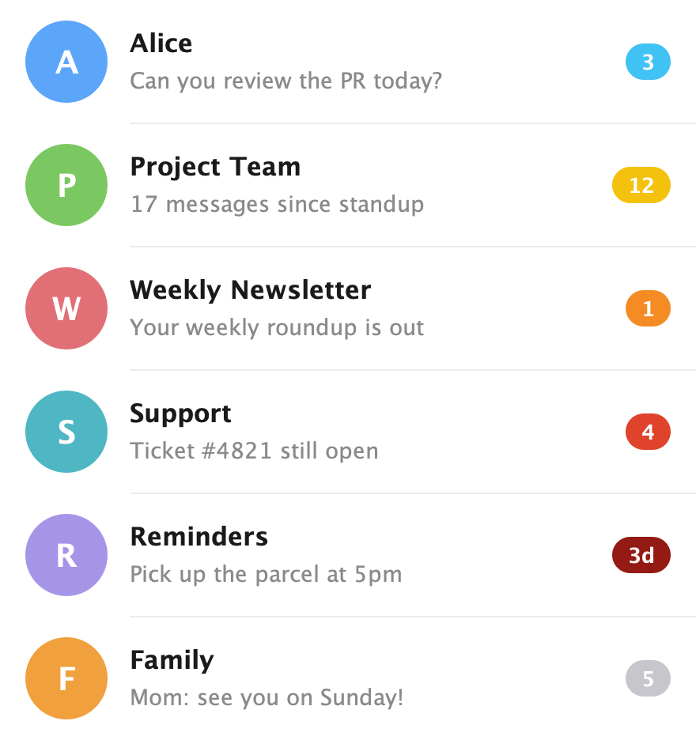

# Unread age badge

Make Telegram's unread indicator convey *how long* a chat has been waiting. For any unread chat, the badge is colored by age along a multi-stop ramp — **blue → yellow → orange → red → dark red** — based on the time of the first unread message, growing warmer and darker the longer it waits, so stale conversations stand out at a glance. The existing unread **count is preserved**; age is encoded in the badge's color rather than replacing the number.

**Branch:** `claude/06-read-later-age-badge`

## How it looks



Top to bottom:

- **Alice** — 3 unread, first message minutes ago → fresh **blue** `3`
- **Project Team** — 12 unread, oldest ~6 h ago → **yellow** `12`
- **Weekly Newsletter** — 1 unread, ~13 h ago → **orange** `1`
- **Support** — 4 unread, ~28 h ago → **red** `4`
- **Reminders** — manually *marked as unread* (no message count), ~3 days ago → **dark red**, showing the elapsed time `3d`
- **Family** — 5 unread but **muted** → stays the neutral **gray** counter (muted chats are not aged)

> Faithful render of the feature's color ramp and labels (`UnreadMarkBadge`), laid out as example chat rows. A live capture would need a logged-in account with chats unread at those ages.

## Behavior

- **Applies to every unread chat** — both chats with unread messages (`unread_count > 0`) and chats you manually *mark as unread* (`unread_mark`).
- **Aged from the first unread message.** When a new message turns a previously-read chat unread, the dialog's top message *is* that first unread one, so its date is stamped and then kept (it isn't moved as more messages arrive). Chats already unread at first render use the top message's date as a best-effort estimate. Manually-marked chats with no unread messages age from when they were marked.
- **Conflict with the unread counter is resolved by keeping the number.** A chat with unread messages keeps its count as the badge text; the *color* carries the age. Only manually-marked chats (no number) show the elapsed-time text instead of a dot.
- **Color ramp (hours-fast):** continuous multi-stop gradient — bright blue (0h) → deep blue (~2h) → yellow (~6h) → orange (~12h) → red (~24h) → dark red (~48h) → darkest red (~96h+, clamped).
- **Muted chats keep their gray counter** — aging deliberately doesn't override the muted treatment.
- **Setting:** on by default; toggle under **Settings → Chat Settings → "Unread age badge"**.
- When a chat is fully read, its stored timestamp is cleared automatically.

## Implementation

All real logic lives in two new, self-contained classes (no conflict surface):

| Class | Responsibility |
|---|---|
| `messenger/UnreadMarkTimeTracker.java` | Per-account, persists *since when* each dialog has been unread in its own `SharedPreferences` file. Fed from `DialogCell` as rows bind; backed by `support.LongSparseLongArray` (no boxing). |
| `messenger/UnreadMarkBadge.java` | Stateless helpers: `getColor(sinceMillis)` (multi-stop ramp via `ColorUtils.blendARGB`) and `formatShort(sinceMillis)` (compact localized duration label). |

## Touched upstream files — merge checklist

After merging upstream, re-verify each of these small, localized edits. Run `git grep -i unreadmarkage` to locate every touch point (all additions share the `unreadMarkAge…` identifier prefix). Everything else lives in new files that cannot conflict.

| File (high-churn?) | What was added |
|---|---|
| `ui/Cells/DialogCell.java` ⚠️ | (1) a field `unreadMarkAgeBadgeTime` + `Paint unreadMarkAgePaint`; (2) in the unread-counter block of `buildLayout`, compute unread state, feed `UnreadMarkTimeTracker`, set the badge timestamp (and badge text for marked-unread); (3) in `drawCounter`, override the badge paint color via `UnreadMarkBadge.getColor(...)` for non-muted, non-folder unread badges. |
| `messenger/SharedConfig.java` ⚠️ | `unreadMarkAgeBadge` boolean (default `true`), its load line, and `toggleUnreadMarkAgeBadge()`. |
| `ui/ThemeActivity.java` ⚠️ | a `TextCheckCell` row (`unreadMarkAgeBadgeRow`) under Chat Settings, mirroring `raiseToSpeakRow` (field, reset, row assignment, onClick, bind, view-type list). |

⚠️ = appears in the repo's top-churn list, so expect occasional merge hunks here.

## Localization (conflict-free)

Strings live in **dedicated** `strings_unread_age_badge.xml` files (one per bundled locale), **not** in upstream `strings.xml` — so they never collide with upstream string changes. Keys are feature-prefixed (`UnreadAgeBadge`, `UnreadAgeBadgeInfo`, `UnreadAgeBadgeDays`, `UnreadAgeBadgeWeeks`). Minute/hour labels reuse upstream's long-standing `ShortMinutesAgo` / `ShortHoursAgo`. Bundled locales: `en, ar, de, es, it, ko, nl, pt-rBR, ru, uk`; other languages fall back to English until translated on Telegram's platform.

## New files

```
TMessagesProj/src/main/java/org/telegram/messenger/UnreadMarkTimeTracker.java
TMessagesProj/src/main/java/org/telegram/messenger/UnreadMarkBadge.java
TMessagesProj/src/main/res/values/strings_unread_age_badge.xml          (+ 9 locale variants)
```
